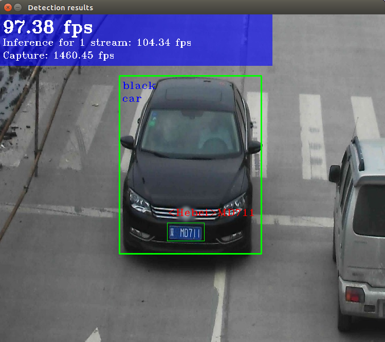
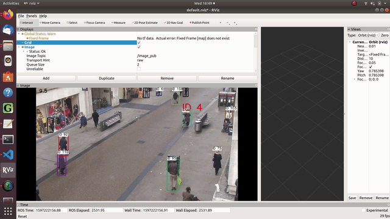

# Vino Tracking and Reidentification Demo with ROS

An edited version of the OpenVINO demo with added features in ROS. 

## Getting Started

These instructions will get you a copy of the project up and running on your local machine for development and testing purposes. See below for notes on how to deploy the project on a live system.

### Prerequisites
```
Intel CPU/GPU/Morvidius VPU/Neural Compute Stick 2 (OpenVINO is optimised to run on Intel processors)
OpenVINO v2020.2
ROS Melodic with cv_bridge set up
OpenCV 3
Run pip install -r requirements.txt to install pre-requisites. 
Git clone into your catkin workspace source folder eg.<catkin_ws/src/>
```
# Installation

## Installing OpenVINO

Instructions for OpenVINO Installation (v 2020.2)

Visit link: https://software.intel.com/content/www/us/en/develop/tools/openvino-toolkit/choose-download.html
Choose Linux and openvino version 2020.2 

Follow instructions on this website after installation
https://docs.openvinotoolkit.org/2020.2/_docs_install_guides_installing_openvino_linux.html


Ensure you can run the demo_security_barrier_camera.sh and view the output as shown below.



### OpenVINO Demos

This project has referenced 2 python openVino Demos: multi_camera_multi_person_tracking and face_recognition.
```
They are found at /opt/intel/openvino/deployment_tools/open_model_zoo/demos/python_demos/<demo-name>
```
Their instructions are found here: 

https://docs.openvinotoolkit.org/2020.2/_demos_python_demos_multi_camera_multi_person_tracking_README.html#quality_measuring
https://docs.openvinotoolkit.org/2020.2/_demos_python_demos_face_recognition_demo_README.html

To install the specific models

```
cd /opt/intel/openvino_2020.2.120/deployment_tools/tools/model_downloader
Run ./downloader --name <model-name> 
For face recognition, download models face-detection-retail-0004, landmarks-regression-retail-0009, face-reidentification-retail-0095
For reidentification, download models person-detection-retail-0013, person-reidentifcation-retail-0031

All downloaded models should be found inside this folder
cd /opt/intel/openvino/deployment_tools/open_model_zoo/tools/downloader/intel/
```

# OpenVino test

## Testing each demo 

You should be able to run these 2 demos individually with OpenVINO and pre-requisites installed.

multi_camera_multi_person_tracking 
```
python multi_camera_multi_person_tracking.py 
--m_detector path/to/person-detection-retail-0013.xml \ 
--m_reid path/to/person-reidentification-retail-0031.xml \ 
--config config.py \ 
-i path/to/video1.avi path/to/video2.avi 
```

face_recognition
```
python face_recognition_demo.py 
-m_fd <path_to_model>/face-detection-retail-0004.xml \
-m_lm <path_to_model>/landmarks-regression-retail-0009.xml \
-m_reid <path_to_model>/face-reidentification-retail-0095.xml \
-fg "<path to gallery folder>"
```

# Configuring with ROS Environment

## Git Clone to your Workspace and Change the respective file paths

First git clone this repo into your catkin workspace source folder
```
* mkdir ~/catkin_ws
* mkdir ~/catkin_ws/src
* cd ~/catkin_ws/src/
* git clone https://github.com/dingxuan97/Vino-Tracking-and-Reid-with-ROS.git
```

### File paths

1. Open multi_camera_multi_person_tracking.py in your preferred platform.
**Change path to the config file at line 227. You should only need to change to the name of your own workspace.**
Ensure the models have been downloaded into the respective paths on lines 232, 242
```
cd ~/catkin_ws/src/vino_reid/scripts/multi_camera_multi_person_tracking/
```

2. Open face_recognition_demo.py in your preferred platform.
**Change line 69 to your own empty folder or folder with images of faces you wish to track.**
Ensure you have downloaded the models at the respective paths shown on lines 76, 78, 80.
```
cd ~/catkin_ws/src/vino_reid/scripts/face_recognition_demo
```

## Setting up cv_bridge

Do install ROS Melodic with Ubuntu LTS 18.04 beforehand. 
The guide of setting up cv_bridge is as follows:
https://cyaninfinite.com/ros-cv-bridge-with-python-3/

Notes:
Check if version of python you are on. (Recommended python3.6 or above)
Double check your CPU architecture x86 or Arm64 (in case you are testing in raspberry) 

In order to run the demo after building cv_bridge
```
* Remove devel and build folders after building cv_bridge 
* source install/setup.bash --extend 
* Open new terminal
* Run catkin_make
```
Note: Try running souce install/setup.bash after the --extend command if it doesnt work. |
      Make sure you are on python 3 environment

# Running the tests

Run the following commands to start the test for the demonstration

## Multi-cam-multi-person-tracking

```
rosrun vino_reid multi_camera_multi_person_tracking.py -i <path to your single or multiple videos/webcams>
```

Press s to select a specific target, you can see the ID gets highlighted in RED in the frame. 

Press d and enter the same ID to remove highlighting the specific ID
```
By default the frame will be published in ros as '/image_pub', you may view on rviz if you wish.
```



Frame rate is slightly slower due to the recording, it should run at least ~15fps

## Face-recognition and reidentification

### This programe compares the ROI from multi-cam-multi-person-tracking to link face with the ID
```
rosrun vino_reid face_recognition.py -i <path to single video or webcam>
```

### Press 'a' and enter name of the person followed by selecting the ROI. After saving the initial ROI, press 's' and enter the same name to automatically save more images of the face into your database for more accurate reidentification.

You may want to save image of the person face from different angles to provide a more accurate reidentification.

Note: This program runs slower because it retrieves frames from multi-cam-multi-person-tracking to attempt to ensure ROIs retrieved at same timing.


## Key Edits 

## Multi-camera-multi-person-tracking
Key functions that has been added in my demo

### multi-camera-multi-person-tracking.py
```
vis = visualize_multicam_detections(target_idx, prev_frames, tracked_objects, fps, **config['visualization_config']
(line 180)
```
I added a new target_idx parameter (default = [-1]) here to input which ever ID that the user wants to specifically track

### visualization.py

### New Publisher
```
In draw_detections(), added rospy publisher to publish the roi of detected ID in order of [id, x1, y1, x2, y2, ...] to the face_recognition_demo
```

## Face-recognition and reidentification

### face_recognition_demo.py

### New Subcriber and Classes

In draw_detection_roi()
```
listener() computes roi received from multi-cam-multi-person-tracking
```
Classes
```
2 new classes: Identity (line 60) and Person (line 67)
A single Person object exists once the programe starts while each ID has an Identity object attached to it.
Each Identity records frames of the names whose roi it has intersected and displays the links the ID with the face name.
Each Identity is appended into the Person object.
```

### Important args: 
```
-fg (Main Database where you input images prior or save images into)
-t_id  Displays names of faces only if the similarity is above the percentage in args.fg
```

### Storing new faces into database:
```
New waitKeys
ord('a') is used to crop out first image of the user face
ord('s') will allow program to auto detect faces which have similarity above 60% and save them into database
```

### New functions:
```
New Function
*Added new function to FrameProcessor class to refresh database everytime a new image is saved.(line 206)
    def refresh_database(self, args):
        log.info("Re-building face database from {}".format(args.fg))
        self.faces_database = FacesDatabase(args.fg, self.face_identifier, self.landmarks_detector, self.face_detector if args.run_detector else None, args.no_show)
	    self.face_identifier.set_faces_database(self.faces_database)
   	    log.info("Database is built, registered {} identities".format(len(self.faces_database)))
```

## Authors

* **Ding Xuan Er** - *Initial work* - [dingxuan97](https://github.com/dingxuan97)
* **Billie Thompson** - *Initial work* - [PurpleBooth](https://github.com/PurpleBooth)

See also the list of [contributors](https://github.com/your/project/contributors) who participated in this project.

## Acknowledgments

* [Cyan Infinite](https://www.youtube.com/watch?v=h-odZn-yGPY&list=PLWw98q-Xe7iH06qxEW5a22SBsSNsGnYjZ) for cv_bridge compilation guide
* [Rocket Systems](https://www.youtube.com/watch?v=h-odZn-yGPY&list=PLWw98q-Xe7iH06qxEW5a22SBsSNsGnYjZ) on Youtube for guidance on creating your own vino projects